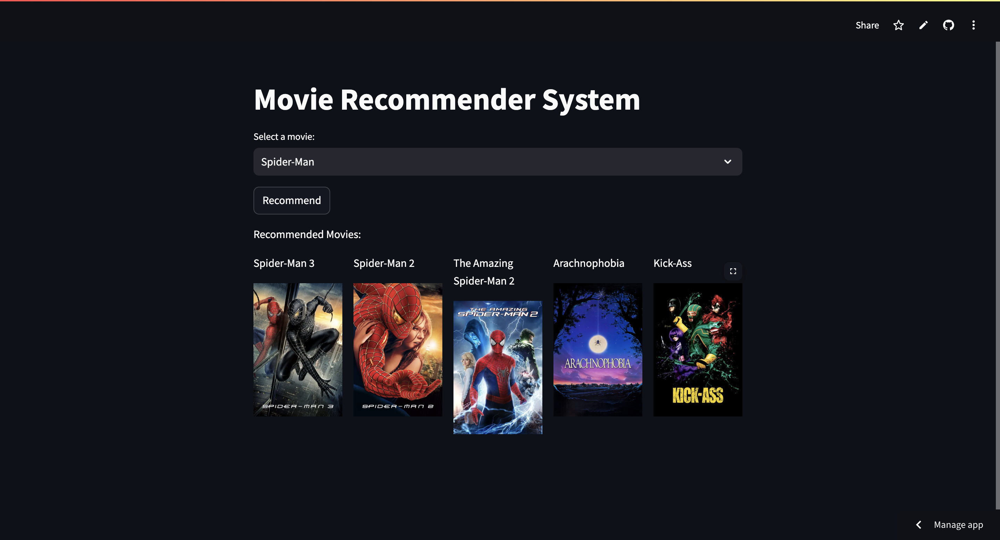

# 🎬 Movie Recommender System

A content-based movie recommendation system built using **cosine similarity**. It suggests movies similar to the selected one and fetches their **posters** using the **TMDb API**. The app is hosted using **Streamlit**.

 
---

## 📌 Features

- Recommends 5 similar movies using **cosine similarity**
- Fetches **movie posters** using **TMDb API**
- Clean UI with **Streamlit** interface
- Includes **Exploratory Data Analysis (EDA)** and preprocessing
- Easy to use – select a movie and get instant recommendations

---

## 🧠 How It Works

1. **Data Preprocessing & EDA**:
   - Handled missing values
   - Merged relevant metadata (genres, cast, crew, etc.)
   - Created a "tags" feature by combining relevant text fields

2. **Feature Extraction**:
   - Applied **Bag-of-Words** 
   - Calculated **cosine similarity** matrix between movies

3. **TMDb API Integration**:
   - Used API to fetch poster images by movie ID

4. **Streamlit App**:
   - Dropdown to select movie
   - Display recommendations with poster thumbnails

---

## 🚀 Demo

🔗 [Click to View Live App](https://recommender-system-x.streamlit.app/)  
<!-- Replace with your actual Streamlit deployment link -->

---

## 📂 Project Structure
---
```
├── app.py # Streamlit app with Core recommendation logic
├── data/ # Dataset files (movies.csv, credits.csv, etc.)
├── eda.ipynb # Jupyter Notebook for EDA           
├── requirements.txt # Python dependencies
└── README.md # This file
```
---
## How to Use?
1. Clone the repository:

```
git clone https://github.com/rohithgowdax/Recommender-System.git
```
2. Install dependencies:
```
pip install -r requirements.txt
```
3. Add your TMDb API key in a .env file or inside the code where required.

4. Run the app:
```
streamlit run app.py

```
---
## 🔧 Tech Stack

- Python
- Pandas, NumPy, scikit-learn
- Streamlit
- TMDb API
- Matplotlib / Seaborn (for EDA)
---
## 📈 Exploratory Data Analysis

EDA was performed to:
  - Understand data distribution
  - Identify and handle missing data
  - Analyze popular genres, actors, keywords, etc.
  - Improve feature engineering for better recommendations
  - Find the full EDA in eda.ipynb.

## 🙋‍♂️ Author
Rohith Gowda R

📧 [Email]([rohithgowdax@gmail.com)       
🔗 [Linkdin](https://www.linkedin.com/in/rohithgowdax/)
___
> **Important Notice:**  
> This project is licensed under the [Apache License](LICENSE).  
> According to the license terms, any redistribution (including compiled or modified versions), you **must** retain the original copyright
> notice and the full license text. Copyright © 2025 Rohith Gowda R. All rights reserved.
